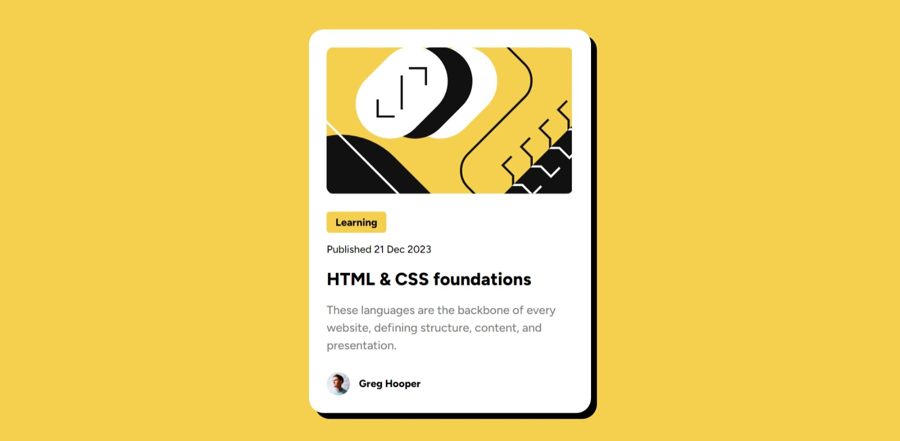

# Frontend Mentor - Blog preview card solution

This is a solution to the [Blog preview card challenge on Frontend Mentor](https://www.frontendmentor.io/challenges/blog-preview-card-ckPaj01IcS). Frontend Mentor challenges help you improve your coding skills by building realistic projects.

## Table of contents

- [Overview](#overview)
  - [Screenshot](#screenshot)
  - [Links](#links)
- [My process](#my-process)
  - [Built with](#built-with)
  - [What I learned](#what-i-learned)
- [Author](#author)

## Overview

### The challenge

Users should be able to:

- See hover and focus states for all interactive elements on the page

### Screenshot

### Links

- Solution URL: [Github](https://github.com/NiloyDas07/BlogPreview)
- Live Site URL: [Live Site](https://niloydas07.github.io/BlogPreview/)

## My process

### Built with

- Semantic HTML5 markup
- CSS custom properties
- Flexbox
- Mobile-first workflow

### What I learned

First of all, I learnt how helpful detailed figma files are! Having accurate measurements saves so much time.
Moving on to the project, this time I learnt how to use our custom cursors. I didn't know how to do that cause most of the time I am just focused on the page design and layout. Never thought about styling the cursor before this challenge, so this was fun. 😊

## Author

- Frontend Mentor - [@NiloyDas07](https://www.frontendmentor.io/profile/NiloyDas07)
