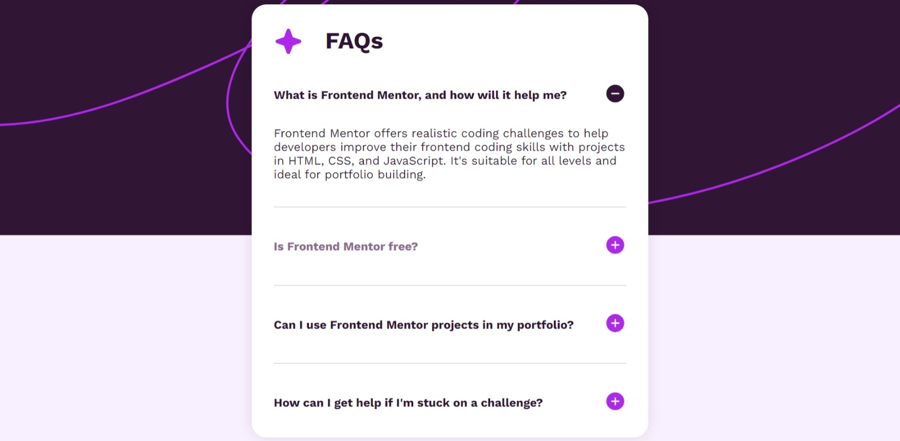

# Frontend Mentor - FAQ accordion solution

This is a solution to the [FAQ accordion challenge on Frontend Mentor](https://www.frontendmentor.io/challenges/faq-accordion-wyfFdeBwBz). Frontend Mentor challenges help you improve your coding skills by building realistic projects.

## Table of contents

- [Overview](#overview)
  - [The challenge](#the-challenge)
  - [Screenshot](#screenshot)
  - [Links](#links)
- [My process](#my-process)
  - [Built with](#built-with)
  - [What I learned](#what-i-learned)
  - [Continued development](#continued-development)
  - [Useful resources](#useful-resources)
- [Author](#author)

## Overview

### The challenge

Users should be able to:

- Hide/Show the answer to a question when the question is clicked
- Navigate the questions and hide/show answers using keyboard navigation alone
- View the optimal layout for the interface depending on their device's screen size
- See hover and focus states for all interactive elements on the page

### Screenshot

### Links

- Solution URL: [GitHub](https://github.com/NiloyDas07/FAQ-Accordion/tree/usingCheckbox)
- Live Site URL: [Live Site](https://niloydas07.github.io/FAQ-Accordion/)

## My process

### Built with

- Semantic HTML5 markup
- CSS custom properties
- Flexbox
- Javascript
- Mobile-first workflow

### What I learned

- This branch is because I really wanted to try and make it without any javascript. I know it's probably not the best in terms of accessibility standards.
- Figuring out the CSS took a lot of time but in return, I learnt a lot of new CSS tricks.
- The hardest part was getting the keyboard navigation to work properly. I personally never browse using the keyboard, so before this project, I never really paid much attention to it.
- My understanding of CSS selectors also became way clearer.

### Continued development

I will pay more attention to accessibility in my future work.

### Useful resources

- The most helpful tool for me was the Bing AI chat / Microsoft Copilot. It makes searching for answers to questions much easier and faster. It's completely free. And the best part is that we can ask follow up questions to get more specific answers. Be careful though, it can give wrong answers sometimes for more complicated stuff. But for basic questions, so far I have always recieved very good answers.

## Author

- Frontend Mentor - [@NiloyDas07](https://www.frontendmentor.io/profile/NiloyDas07)
