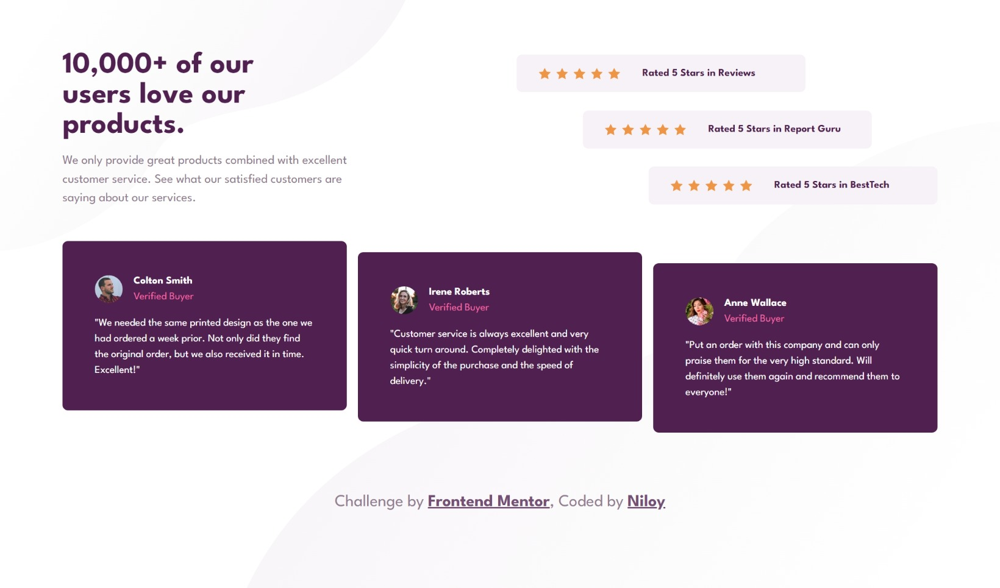

# Frontend Mentor - Social proof section solution

This is a solution to the [Social proof section challenge on Frontend Mentor](https://www.frontendmentor.io/challenges/social-proof-section-6e0qTv_bA). Frontend Mentor challenges help you improve your coding skills by building realistic projects.

## Table of contents

- [Overview](#overview)
  - [The challenge](#the-challenge)
  - [Screenshot](#screenshot)
  - [Links](#links)
- [My process](#my-process)
  - [Built with](#built-with)
  - [Useful resources](#useful-resources)
- [Author](#author)

## Overview

### The challenge

Users should be able to:

- View the optimal layout for the section depending on their device's screen size

### Screenshot

### Links

- Solution URL: [Github](https://github.com/NiloyDas07/Frontend-Mentor-Social-Proof-Section/)
- Live Site URL: [Live Site](https://niloydas07.github.io/Frontend-Mentor-Social-Proof-Section/)

## My process

### Built with

- Semantic HTML5 markup
- CSS custom properties
- Flexbox
- CSS Grid
- Mobile-first workflow

### Useful resources

- [CSS-Tricks](https://css-tricks.com/) - I always refer to this whenever I forget something about flex or grid.

## Author

- Frontend Mentor - [@NiloyDas07](https://www.frontendmentor.io/profile/NiloyDas07)
