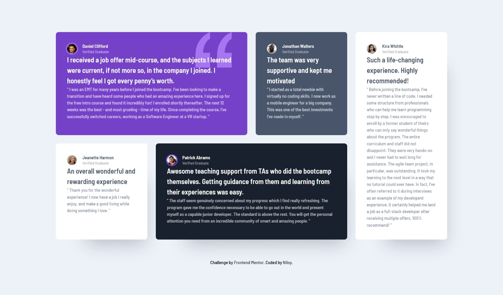

# Frontend Mentor - Testimonials grid section solution

This is a solution to the [Testimonials grid section challenge on Frontend Mentor](https://www.frontendmentor.io/challenges/testimonials-grid-section-Nnw6J7Un7). Frontend Mentor challenges help you improve your coding skills by building realistic projects.

## Table of contents

- [Overview](#overview)
  - [The challenge](#the-challenge)
  - [Screenshot](#screenshot)
  - [Links](#links)
- [My process](#my-process)
  - [Built with](#built-with)
  - [What I learned](#what-i-learned)
  - [Useful resources](#useful-resources)
- [Author](#author)

## Overview

### The challenge

Users should be able to:

- View the optimal layout for the site depending on their device's screen size

### Screenshot

### Links

- Solution URL: [GitHub](https://github.com/NiloyDas07/Frontend-Mentor-Testimonials-Grid-Section/)
- Live Site URL: [Live Site](https://niloydas07.github.io/Frontend-Mentor-Testimonials-Grid-Section/)

## My process

### Built with

- Semantic HTML5 markup
- CSS custom properties
- Flexbox
- CSS Grid
- Mobile-first workflow

### What I learned

- The concepts of CSS Grid have become much clearer to me. I now feel more comfortable and confident using Grid in my future projects. Earlier, I just used Flexbox everywhere, regardless of the layout.

- I learnt about BEM and tried using it for the first time.

### Useful resources

- [css-tricks](https://css-tricks.com/snippets/css/complete-guide-grid/) - A great resource to learn more about CSS Flexbox, Grid, and more.

## Author

- Frontend Mentor - [@NiloyDas07](https://www.frontendmentor.io/profile/NiloyDas07)
- Github - [@NiloyDas07](https://github.com/NiloyDas07)
